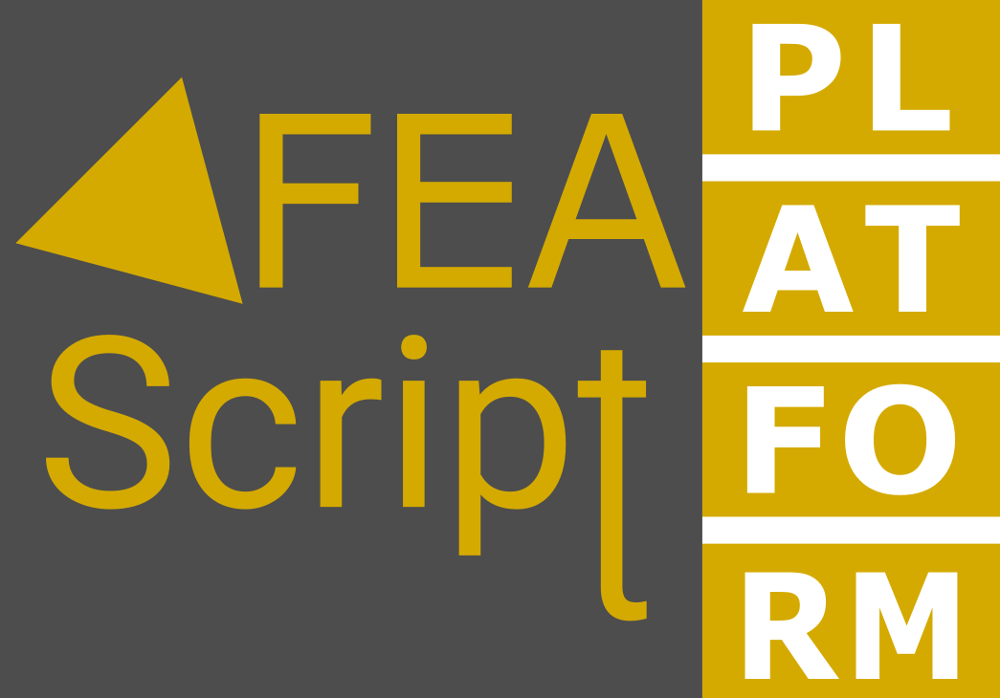

# FEAScript-platform

[FEAScript platform](https://platform.feascript.com/) is browser-based visual editor designed for the [FEAScript finite element simulation library](https://github.com/FEAScript/FEAScript-core). It empowers users to create and run finite element simulations directly in their browser.

## License

FEAScript platform is released under the [MIT license](https://github.com/FEAScript/FEAScript-platform/blob/main/LICENSE). &copy; 2023-2025 FEAScript.
